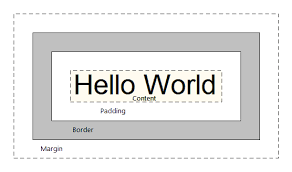

# Entendendo o Box Model

O **Box Model** no CSS é um conceito essencial para entender como os elementos HTML são posicionados e dimensionados na página. Cada elemento HTML pode ser considerado como uma caixa retangular composta por quatro partes:

1. **Content (Conteúdo)**: O conteúdo do elemento, como texto ou imagens.
2. **Padding (Preenchimento)**: Espaço entre o conteúdo e a borda do elemento. Ele "empurra" o conteúdo para dentro.
3. **Border (Borda)**: A borda que envolve o padding e o conteúdo. Pode ser estilizada de diferentes formas.
4. **Margin (Margem)**: Espaço externo que separa o elemento de outros elementos.

Aqui está uma visualização gráfica do Box Model:

---

### Imagem do Box Model (Descrição)

Imagine um retângulo dividido em quatro seções:
- A seção central contém o **conteúdo**.
- Em torno do conteúdo, há uma camada chamada **padding** (preenchimento), que é como um espaço acolchoado que empurra o conteúdo para dentro.
- A **borda** envolve o padding, como uma linha que circunda o conteúdo e o padding.
- Por fim, a camada mais externa é a **margem**, que é o espaço entre o elemento e os outros ao redor.


---

### Exemplo de Código do Box Model

```html
<!DOCTYPE html>
<html lang="en">
<head>
    <meta charset="UTF-8">
    <meta name="viewport" content="width=device-width, initial-scale=1.0">
    <title>Exemplo do Box Model</title>
    <style>
        /* Estilizando o elemento com Box Model */
        .box {
            width: 200px; /* Largura do conteúdo */
            padding: 20px; /* Espaço interno */
            border: 5px solid #e43c5c; /* Borda sólida */
            margin: 20px; /* Margem externa */
            background-color: lightblue; /* Cor de fundo para destaque */
        }
    </style>
</head>
<body>

    <h1>Entendendo o Box Model</h1>
    
    <div class="box">
        Este é um exemplo de elemento com o Box Model aplicado.
    </div>

</body>
</html>
```

### Explicação:

- **`width: 200px;`**: Define a largura do conteúdo do elemento como 200 pixels.
- **`padding: 20px;`**: Adiciona um preenchimento de 20 pixels ao redor do conteúdo, empurrando-o para dentro.
- **`border: 5px solid #e43c5c;`**: Cria uma borda sólida de 5 pixels ao redor do padding.
- **`margin: 20px;`**: Adiciona 20 pixels de margem ao redor da caixa, separando o elemento de outros ao redor.
- **`background-color: lightblue;`**: Define a cor de fundo do conteúdo para destacar visualmente o exemplo.

---

### Como o Box Model Afeta o Tamanho Final do Elemento

Quando definimos as propriedades de `width` e `height` em um elemento, estamos apenas especificando o **tamanho do conteúdo**. O tamanho total do elemento incluirá também o `padding`, a `border`, e as `margin`, que podem aumentar as dimensões visíveis do elemento.

#### Cálculo do Tamanho Total:

- **Largura total** = `width` + `padding esquerdo` + `padding direito` + `border esquerdo` + `border direito`.
- **Altura total** = `height` + `padding superior` + `padding inferior` + `border superior` + `border inferior`.

No exemplo acima:
- **Largura total** = 200px (conteúdo) + 20px (padding esquerdo) + 20px (padding direito) + 5px (border esquerdo) + 5px (border direito) = **250px**.
- **Altura total** seria calculada da mesma forma, se especificada.

### Box-Sizing: Border-Box

Por padrão, o CSS usa o modelo de caixa **content-box**, onde o `padding` e a `border` são adicionados à `width` e à `height`, o que aumenta o tamanho total do elemento. 

Se quisermos que a `width` e a `height` incluam o `padding` e a `border` dentro do valor especificado, podemos usar a propriedade `box-sizing: border-box;`:

```css
.box {
    box-sizing: border-box; /* Inclui padding e border dentro do tamanho */
}
```

Agora, o tamanho especificado para `width` e `height` será o tamanho total do elemento, incluindo `padding` e `border`, tornando o layout mais previsível.

---
