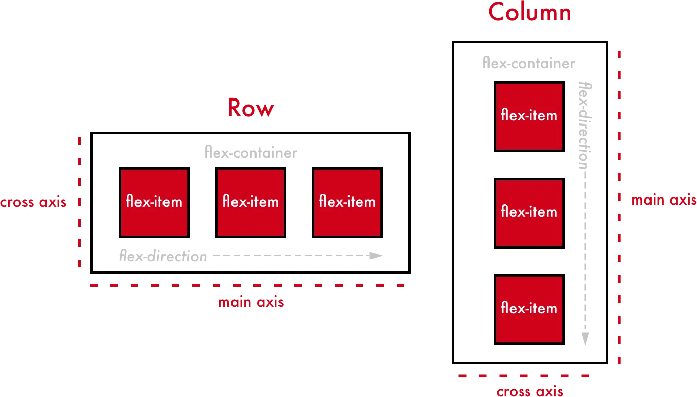

# CSS Flexbox

O Flexbox (Flexible Box Layout) é um modelo de layout introduzido no CSS3 que facilita a criação de layouts flexíveis e responsivos, controlando o alinhamento, distribuição de espaço e ordenação de elementos dentro de um container. A principal vantagem do Flexbox é sua capacidade de ajustar automaticamente os elementos em diferentes tamanhos de tela, sem precisar de muitas media queries.



## Principais Conceitos do Flexbox

- **Container flexível**: O elemento pai que contém os itens flexíveis.
- **Itens flexíveis**: Os filhos diretos do container que são organizados pelo Flexbox.

### Propriedades do Container Flexível

1. **display: flex;**  
   Ativa o Flexbox no elemento pai (container).
   
2. **flex-direction**  
   Define a direção principal dos itens flexíveis:
   - `row`: alinha os itens na horizontal (padrão).
   - `row-reverse`: alinha os itens na horizontal, mas com ordem inversa.
   - `column`: alinha os itens na vertical.
   - `column-reverse`: alinha os itens na vertical, mas com ordem inversa.

3. **justify-content**  
   Alinha os itens ao longo do eixo principal (horizontal por padrão):
   - `flex-start`: Alinha ao início do container.
   - `flex-end`: Alinha ao final do container.
   - `center`: Centraliza os itens.
   - `space-between`: Distribui os itens com espaço igual entre eles.
   - `space-around`: Distribui os itens com espaço igual ao redor.

4. **align-items**  
   Alinha os itens ao longo do eixo perpendicular (vertical por padrão):
   - `flex-start`: Alinha ao início.
   - `flex-end`: Alinha ao final.
   - `center`: Centraliza os itens verticalmente.
   - `stretch`: Alinha os itens esticando-os para preencher o espaço.

5. **flex-wrap**  
   Define se os itens devem quebrar em várias linhas:
   - `nowrap`: Não permite a quebra (padrão).
   - `wrap`: Permite a quebra de linha.
   - `wrap-reverse`: Quebra de linha na ordem inversa.

### Propriedades dos Itens Flexíveis

1. **order**  
   Controla a ordem de exibição dos itens. Por padrão, todos têm o valor `0`, mas você pode definir um valor positivo ou negativo para alterar a ordem.

2. **flex-grow**  
   Define quanto um item pode crescer em relação aos outros. Se todos tiverem `flex-grow: 1`, eles crescem igualmente. Se um item tiver `flex-grow: 2`, ele ocupará o dobro do espaço dos outros.

3. **flex-shrink**  
   Define quanto um item pode encolher se o espaço disponível for menor que o necessário.

4. **flex-basis**  
   Define o tamanho inicial do item antes de ele crescer ou encolher.

5. **align-self**  
   Permite sobrescrever o alinhamento do item definido em `align-items` no container. Valores: `auto`, `flex-start`, `flex-end`, `center`, `baseline`, `stretch`.

---

## Exemplo Simples de Flexbox

### HTML

```html
<div class="container">
  <div class="item">Item 1</div>
  <div class="item">Item 2</div>
  <div class="item">Item 3</div>
</div>
```

### CSS

```css
/* Definindo o container como flexível */
.container {
  display: flex;
  flex-direction: row; /* Alinhamento horizontal (padrão) */
  justify-content: space-between; /* Espaço igual entre os itens */
  align-items: center; /* Alinha os itens ao centro verticalmente */
  height: 200px;
  background-color: #f0f0f0;
}

/* Estilizando os itens */
.item {
  background-color: #4CAF50;
  padding: 20px;
  margin: 10px;
  color: white;
  font-size: 20px;
}
```

### Resultado:

Os itens serão organizados horizontalmente dentro do container, com espaço igual entre eles, centralizados verticalmente.

### Exemplo de Flex-wrap

Caso você queira que os itens quebrem em várias linhas:

```css
.container {
  display: flex;
  flex-wrap: wrap; /* Permite a quebra de linha */
  justify-content: center;
  align-items: flex-start;
}
```

Se houver muitos itens, eles serão organizados em várias linhas, mas alinhados ao início do container no eixo vertical.

### Exemplo de Ordem Diferente

Para alterar a ordem de exibição de um item:

```css
.item:nth-child(2) {
  order: 1; /* Exibe o segundo item por último */
}
```

O segundo item será exibido após o terceiro, mudando sua posição sem alterar o HTML.

---

Esses são os conceitos e exemplos básicos para começar a usar Flexbox. Ele facilita a criação de layouts mais dinâmicos e flexíveis com menos código comparado aos métodos anteriores como `float` e `inline-block`.